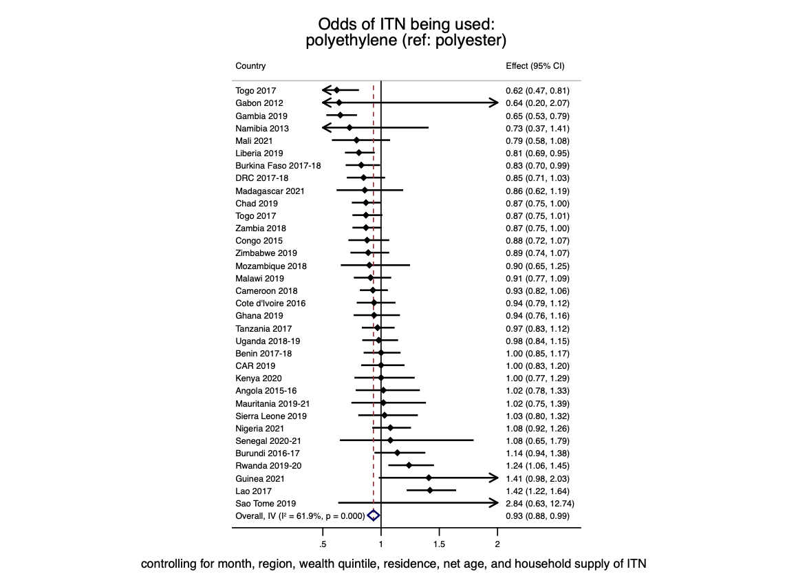

```{r setup, include=FALSE}

# Before running this:
  # 1. Run 1. ITN Textile w month.do in Analysis/Textile for any new surveys
  # 2. Run 6. Regional Loop (for regional excel file results) for any new surveys


knitr::opts_chunk$set(echo = FALSE)
library(tidyverse)
library(knitr)
library(readxl)
library(janitor)
library(maptools)
library(maps)
library(broom)
library(spData)
library(sf)
library(cowplot)
library(rdhs)
library(RColorBrewer)
library(ggpubr)
```

This website provides [reports](reports.html) for countries in sub-Saharan Africa to evaluate whether there are differences in use of insecticide-treated nets (ITNs) due to the textile of ITNs (i.e. polyester or polyethylene).

Some countries may wish to procure ITNs of a particular textile. These reports use large household survey data to evaluate whether there are differences in use between polyester and polyethylene nets in a particular country, and whether net textile is associated with these differences after controlling for other determinants of net use.

These [reports](reports.html) walk through several key questions to ask as we consider this question and provide recommendations for next steps.

In four countries, publicly available surveys have collected information on household preferences for net textile. This data is summarized on the [Preferences](prefs.html) page.

This work is supported by the Alliance for Malaria Prevention with funding from The Bill & Melinda Gates Foundation.


```{r read}
# read in data, tag most recent survey per country, clean country names for joining
df <-
  read_excel(
    "/Users/hannahkoenker/Dropbox/A DHS MIS Datasets/Analysis/Textile/textile_use_m.xlsx"
  ) %>%
  clean_names() %>%
  mutate(
    diffuse = abs(
      percent_of_polyester_nets_used - percent_of_polyethylene_nets_used
    ),
    country = str_replace_all(country, "[:digit:]", ""),
    country = str_replace_all(country, " -", ""),
    country = str_trim(country)
  ) %>%
  group_by(country) %>%
  slice(which.max(year)) %>%
  mutate(
    diff5 = if_else(diffuse > 5, ">5 points difference", "<=5 points difference"),
    country = case_when(
      country == "GuineaBissau" ~ "Guinea-Bissau",
      country == "Gambia" ~ "The Gambia",
      country == "Congo" ~ "Republic of Congo",
      country == "DRC" ~ "Democratic Republic of the Congo",
      country == "CAR" ~ "Central African Republic",
      TRUE ~ as.character(country)
    ),
    diff = if_else(p_value_crudeuse > 0.05, -1, diffuse),
    diff = cut(diff, breaks = c(-2, 0, 5, 10, 15, Inf)),
    name = country,
    aor_for_textile = if_else(is.na(p_0_05_aor), 1, aor_for_textile),
    aor_for_textile = ifelse(is.na(country), NA, aor_for_textile),
    melogit_aor = if_else(is.na(melogit_star),1,note_aor_is_controlling_for_net_supply_region_ses_residence_month),
    justify = case_when(
      (p_value_crudeuse < 0.05 & aor_for_textile!=1 & !is.na(aor_for_textile)) ~ "Both significant",
      (p_value_crudeuse < 0.05 & aor_for_textile==1) ~ "Crude use is different, but textile not a predictor in model",
      (p_value_crudeuse > 0.05 & aor_for_textile!=1 & !is.na(aor_for_textile)) ~ "No difference in crude use, but textile is a predictor in model",
      (p_value_crudeuse > 0.05 & aor_for_textile==1) ~ "Neither significant"
    ),
    justify = factor(justify, levels = c("Both significant","Crude use is different, but textile not a predictor in model","No difference in crude use, but textile is a predictor in model","Neither significant"))
    )
```

```{r worldmap}
africa = world %>% 
  filter(continent == "Africa", !is.na(iso_a2)) %>% 
  left_join(worldbank_df, by = "iso_a2") %>% 
  dplyr::select(name, subregion) %>% 
  left_join(df, by="name") %>% 
  st_transform("+proj=aea +lat_1=20 +lat_2=-23 +lat_0=0 +lon_0=25")

```

```{r make_sf}
crs_africa <-  st_crs(africa)
```

<h1>Summary</h1>
Data from the most recent MIS, DHS, and MICS were obtained with permission from dhsprogram.com and mics.unicef.org. We plot several maps below of relevant indicators. We want to look at a few key questions:

1. How big are any differences in use between polyester and polyethylene nets?

  - If both nets are used at largely the same rates, the choice of textile is unlikely to be a major consideration for procurements
  
2. What is the contribution of textile to net use after controlling for other factors?

  - Many other factors influence net use decisions; textile is only one. It can be closely related to net age, for example, if an earlier campaign was one type and the most recent campaign a different type. It's important to control for these factors to assess whether textile remains important predictor of net use. If it is not an important predictor, programmes can feel comfortable procuring both types of nets.
  
3. Are the findings above consistent?

  - If there is both a difference in the use rate between textiles, and textile is an important predictor after controlling for other factors, it may be worthwhile to explore further. If the findings above are contradictory, programmes can feel comfortable procuring both types of nets.
  
4. How complete is net textile information?

  - It's good to confirm whether the data about net textile is complete; if a large percentage of nets are missing information, we should feel less certain about the overall results. 
  
5. Do countries have a mix of nets, or predominantly one type?

  - It's also good to check whether countries have predominantly one type of net, as this can potentially skew some of the results above.
  
6. What's happening at the regional level?

  - National level results can mask regional variation. Currently we present regional results within the country reports and for selected countries on this page. Additional regional-level results are currently in development.

7. What is the overall trend across countries?

  - Results can be combined from multiple countries to assess the overall trend in net use as a function of textile. 
  

<h2>1. How big are the differences in use between PE and PET nets?</h2>

Figure \@ref(fig:usediff) presents the crude (absolute) difference between the proportion of polyester nets used the previous night and the proportion of polyethylene nets used the previous night. In nearly all cases this difference is less than 10 percentage points and the majority of recent surveys show no significant difference in the overall use rate of nets of different textiles.


``` {r usediff, layout="l-body-outset", fig.cap = "Crude difference in % of nets used between textiles", fig.topcaption=TRUE}
ggplot(africa) +
  geom_sf(data = africa, aes(fill = factor(diff)),
          color = "lightgrey") +
  coord_sf(crs = st_crs(africa)) +
  theme_void() +
  scale_fill_brewer(
    # values = c("gray", "thistle", "plum", "orchid"),
    palette = "BuPu",
    na.value = "WhiteSmoke",
    labels = c("no difference",
    "<5 pts",
               "5-9.9 pts")
    # ,
    #            "10-15 pts")
  ) +
  labs(fill = "Use difference",
       color = "",
       title = "",
       caption = "") +
  theme(plot.margin = grid::unit(c(0, 0, 0, 0), "null"))

```

<h2>2. Is textile an important predictor of net use after controlling for other factors?</h2>

Figure \@ref(fig:sigmultivar) summarizes countries where the most recent survey shows a correlation between the textile of a net and whether it was used the previous night. In most countries, textile is not significantly correlated with use when controlling for other key factors, such as the household's net supply (# of nets and # of family members), the month of the survey (seasonality), region, urban/rural, and wealth quintile.

``` {r sigmultivar, layout="l-body-outset", fig.cap = "Correlation of textile with use: adjusted for household supply of nets, net age, region, wealth, urban/rural, net age, and month", fig.topcaption=TRUE}

ggplot(africa) +
  geom_sf(data = africa, aes(fill = aor_for_textile), color = "lightgray") +
  coord_sf(crs = st_crs(africa)) +
  theme_void() +
  scale_fill_gradient2(
    low = "lightblue",
    mid = "ghostwhite",
    high = "lightcoral",
    midpoint = 1.0,
    na.value = "WhiteSmoke"
  ) +
  annotate(
    "text",
    x = 1900000,
    y = 2700000,
    label = "Polyester more \nlikely to be used",
    size = 2.5,
    color = "cadetblue",
    fontface = "bold"
  ) +
  annotate(
    "text",
    x = 2000000,
    y = -900000,
    label = "Polyethylene more \nlikely to be used",
    size = 2.5,
    color = "lightcoral",
    fontface = "bold"
  ) +
  annotate(
    "text",
    x = -2500000,
    y = -2750000,
    label = "No correlation",
    size = 2.5,
    color = "#696969",
    fontface = "bold"
  ) +
  geom_curve(
    aes(
      x = -2000000,
      y = -2500000,
      xend = -1400000,
      yend = -1500000
    ),
    arrow = arrow(length = unit(0.08, "inch")),
    linewidth = 0.5,
    color = "grey",
    curvature = -0.3
  ) +
  geom_curve(
    aes(
      x = 1000000,
      y = 2700000,
      xend = -2450000,
      yend = 1750000
    ),
    arrow = arrow(length = unit(0.08, "inch")),
    linewidth = 0.5,
    color = "cadetblue",
    curvature = 0.3
  ) +
  geom_curve(
    aes(
      x = 1000000,
      y = -900000,
      xend = 600000,
      yend = -400000
    ),
    arrow = arrow(length = unit(0.08, "inch")),
    linewidth = 0.5,
    color = "lightcoral",
    curvature = -0.3
  ) +
  labs(
    fill = "Adjusted odds ratio",
    title = "",
    subtitle = "",
    caption = ""
  ) +
  theme(plot.margin = grid::unit(c(0, 0, 0, 0), "null"))


    # title = "Textile significantly correlated with use in multivariate model"
# ggsave("multivarsignif_map.png")

# Note: Previously, because 'month' variable was extended in Stata's models and not in the R models, there was a signal change for Burkina Faso and for Chad. This was fixed Jan 4 2021.
```

<h2>3. Are the findings above consistent?</h2>

The results from Figures 1 and 2 can frequently be contradictory. A country like DRC shows a crude difference in the percent of nets used of between 5-10 percentage points - but textile is not a significant predictor of use in the multivariate regression model. Conversely, Togo has no difference in the crude use rate for nets of different textile, but when controlling for background factors, textile is significantly associated with use. The map below summarizes which countries have these 'inconclusive' findings, and for which countries both the crude use rate differences and the model results are telling the same story. In these countries, further exploration is warranted. 

``` {r justifmap, layout="l-body-outset", fig.cap = "Crude and adjusted results", fig.topcaption=TRUE}
ggplot(africa) +
  geom_sf(data = africa, aes(fill = as.factor(justify)), color = "lightgray") +
  coord_sf(crs = st_crs(africa)) +
  theme_void() +
  # scale_fill_brewer(palette = "Set2",
  scale_fill_manual(
    values = c("lightseagreen", "lightsteelblue", "steelblue", "ghostwhite"),
    na.value = "WhiteSmoke"
  ) +
  labs(
    fill = "",
    title = "",
    subtitle = "",
    caption = ""
  ) +
  theme(plot.margin = grid::unit(c(0, 0, 0, 0), "null"))

```  

<h2>4. How complete is the information we have for net textile in these surveys?</h2>

The textile is determined from the brand information collected in the survey; in some surveys the proportion of nets with an unknown brand can be considerable. Figure \@ref(fig:txtunknown) summarizes the proportion of nets with an unknown brand and thus an unknown textile. This provides important context when interpreting results above.

```{r txtunknown, layout="l-body-outset", fig.cap = "Proportion of nets with unknown brand & textile", fig.topcaption=TRUE}
ggplot(africa) +
  geom_sf(data = africa, aes(fill = percent_nets_that_are_unknown_other_pp), color = "lightgray") +
  coord_sf(crs = st_crs(africa)) +
  theme_void() +
  scale_fill_fermenter(palette = "PuRd",direction = 1,
                       na.value = "WhiteSmoke") +
  labs(
    fill = "",
    title = "",
    subtitle = "",
    caption = ""
  ) +
  theme(plot.margin = grid::unit(c(0, 0, 0, 0), "null"))
```

<h2>5. Do countries have primarily one type of net, or a mix?</h2>

Figure \@ref(fig:polyester) illustrates the relative share of polyester and polyethylene nets within countries - darker reds indicate a high proportion of polyethylene nets, and darker blues indicate majority polyester nets. It's important to keep in mind this is from the time of the most recent survey; the picture may be different if the survey has a high percentage of nets with an unknown brand (see above), and if a country has conducted a mass campaign since the survey.

```{r polyester, layout="l-body-outset", fig.cap = "Proportion of nets that are polyester", fig.topcaption=TRUE}
ggplot(africa) +
  geom_sf(data = africa, aes(fill = percent_nets_that_are_polyester), color = "lightgray") +
  coord_sf(crs = st_crs(africa)) +
  theme_void() +
  # scale_fill_steps2(n.breaks = 8,
  #   low = "white",
  #   mid = "lightblue",
  #   high = "lightgreen",
  #   midpoint = 40,
  #   na.value = "WhiteSmoke"
  # ) +
  scale_fill_distiller(palette = "RdBu", direction = 1,
                       na.value = "WhiteSmoke") +
   annotate(
    "text",
    x = -2500000,
    y = -800000,
    label = "Mostly polyester",
    size = 2.5,
    color = "steelblue",
    fontface = "bold"
  ) +
  geom_curve(
    aes(
      x = -2500000,
      y = -600000,
      xend = -2700000,
      yend = 500000
    ),
    arrow = arrow(length = unit(0.08, "inch")),
    linewidth = 0.5,
    color = "steelblue",
    curvature = -0.2
  ) +
  annotate(
    "text",
    x = 1750000,
    y = -3750000,
    label = "Mostly polyethylene",
    size = 2.5,
    color = "firebrick",
    fontface = "bold"
  ) +
  geom_curve(
    aes(
      x = 1500000,
      y = -3500000,
      xend = 1450000,
      yend = -2100000
    ),
    arrow = arrow(length = unit(0.08, "inch")),
    linewidth = 0.5,
    color = "firebrick",
    curvature = 0.3
  ) +
  labs(
    fill = "",
    title = "",
    subtitle = "",
    caption = ""
  ) +
  theme(plot.margin = grid::unit(c(0, 0, 0, 0), "null"))
```

``` {r map_sigmelogit}
# mel <- ggplot(africa) +
#   geom_sf(data = africa, aes(fill = factor(melogit_p_value<0.05)),
#           color = "lightgray") +
#   coord_sf(crs = st_crs(africa)) +
#   theme_void() +
#   scale_fill_manual(values = c("gray","steelblue"),
#                     na.value = "WhiteSmoke",
#                     labels = c("No",
#                                "Yes")) +
#   labs(fill = "",
#        title = "Multilevel mixed-effects logistic regression model",
#        subtitle = "Textile significantly correlated with use, \nadjusted for household supply of nets, region, wealth, urban/rural, and month",
#        caption = "Data source: most recent DHS, MIS, MICS") +
#   theme(plot.margin = grid::unit(c(0, 0, 0, 0), "null"))
# mel
# title = "Textile significantly correlated with use in multivariate model"
# ggsave("multivarsignif_map.png")
```

``` {r map_melogit2}
# Mixed effects results - not weighted for surveys! accounts for clustering within the cluster but not at household level.

# 
# mel2 <- ggplot(aft) +
#   geom_sf(data = aft, aes(fill = melogit_aor),
#           color = "lightgray") +
#   coord_sf(crs = st_crs(aft)) +
#   theme_void() +
#   scale_fill_gradient2(
#     low = "lightcoral",
#     mid = "ghostwhite",
#     high = "lightblue",
#     midpoint = 1.0,
#     na.value = "WhiteSmoke"
#   ) +
#   labs(fill = "",
#        title = "Multilevel mixed-effects logistic regression model",
#        subtitle = "Textile significantly correlated with use, \nadjusted for household supply of nets, net age, region, wealth, urban/rural, and month",
#        caption = "Data source: most recent DHS, MIS, MICS") +
#   theme(plot.margin = grid::unit(c(0, 0, 0, 0), "null"))
# mel2

```

```{r readreg}
reg <- read_excel("/Users/hannahkoenker/Dropbox/A DHS MIS Datasets/Analysis/Textile/reg_textile_use.xlsx"
  ) %>%
  clean_names()
```

```{r burkina}
# set_rdhs_config(timeout = 120)

# Nov 6 2023 - cannot get 2021 download_boundaries to work for 2021DHS. Using 2017 survey boundaries and merging into 2021 results.

bf <- dhs_data(countryIds = "BF",
              indicatorIds = "FE_FRTR_W_A15",
              surveyYearStart = 2017,
              breakdown = "subnational") %>% 
  mutate(region = base::iconv (CharacteristicLabel, to="ASCII//TRANSLIT"),
         region = gsub("'", '', region),
         region = gsub("-", ' ', region),
         region = tolower(region),
         region = gsub("\\(including ouagadougou\\)", '', region),
         region = gsub("hauts bas", 'hauts-bas', region),)

# get our related spatial data frame object
spbf <- download_boundaries(surveyId = bf$SurveyId[1], method = "sf")

# bfshp<-list.files("rdhs/bf_sdr_subnational_boundaries_2022-01-11/shps/", pattern = ".shp$",full.names=TRUE)
```

``` {r liberia}
lb <- dhs_data(countryIds = "LB",
              indicatorIds = "FE_FRTR_W_A15",
              surveyYearStart = 2019,
              breakdown = "subnational") %>% 
  mutate(region = base::iconv (CharacteristicLabel, to="ASCII//TRANSLIT"),
         region = gsub("'", '', region),
         region = tolower(region))


# get our related spatial data frame object
splb <- download_boundaries(surveyId = lb$SurveyId[1], method = "sf")
# lbshp<-list.files("rdhs/lb_subnational_boundaries_2022-01-11/shps/", pattern = ".shp$",full.names=TRUE)
```

``` {r guinea}
gn <- dhs_data(countryIds = "GN",
              indicatorIds = "FE_FRTR_W_A15",
              surveyYearStart = 2018,
              breakdown = "subnational") %>% 
  mutate(region = base::iconv (CharacteristicLabel, to="ASCII//TRANSLIT"),
         region = gsub("'", '', region),
         region = tolower(region))


# get our related spatial data frame object
spgn <- download_boundaries(surveyId = gn$SurveyId[1], method = "sf")
# gnshp<-list.files("rdhs/gn_subnational_boundaries_2022-01-11/shps/", pattern = ".shp$",full.names=TRUE)

```

``` {r guinea21}
gn21 <- dhs_data(countryIds = "GN",
              indicatorIds = "FE_FRTR_W_A15",
              surveyYearStart = 2021,
              breakdown = "subnational") %>% 
  mutate(region = base::iconv (CharacteristicLabel, to="ASCII//TRANSLIT"),
         region = gsub("'", '', region),
         region = tolower(region))


# get our related spatial data frame object
spgn21 <- download_boundaries(surveyId = gn21$SurveyId[1], method = "sf")
# gnshp<-list.files("rdhs/gn_subnational_boundaries_2022-01-11/shps/", pattern = ".shp$",full.names=TRUE)

```

``` {r mali}
ml <- dhs_data(countryIds = "ML",
              indicatorIds = "ML_NETP_H_MOS",
              surveyYearStart = 2021,
              breakdown = "subnational") %>% 
  mutate(region = base::iconv (CharacteristicLabel, to="ASCII//TRANSLIT"),
         region = gsub("'", '', region),
         region = tolower(region)) %>% 
  filter(region %in% c("..kayes","..koulikoro","..sikasso","..segou","..mopti","....tombouctou","....gao","....kidal","bamako")) %>% 
  mutate(region = gsub("[..]","",region))


# get our related spatial data frame object
spml <- download_boundaries(surveyId = ml$SurveyId[1], method = "sf")
# gnshp<-list.files("rdhs/gn_subnational_boundaries_2022-01-11/shps/", pattern = ".shp$",full.names=TRUE)

```


``` {r rwanda}
rw <- dhs_data(countryIds = "RW",
              indicatorIds = "FE_FRTR_W_A15",
              surveyYearStart = 2019, 
              breakdown = "subnational") %>% 
  mutate(region = base::iconv (CharacteristicLabel, to="ASCII//TRANSLIT"),
         region = gsub("'", '', region),
         region = tolower(region))


# get our related spatial data frame object
sprw <- download_boundaries(surveyId = rw$SurveyId[1], method = "sf")

# rwshp<-list.files("rdhs/rw_sdr_subnational_boundaries_2022-01-11/shps/", pattern = ".shp$",full.names=TRUE)
```

``` {r tanzania}
# Nov 6 2023, 2022 boundaries not yet available (timeout)
# Nov 6 2023, 2017 boundaries have two dfs, zonal (1) and regional (2)

tz <- dhs_data(countryIds = "TZ",
              indicatorIds = "FE_FRTR_W_A15",
              # selectSurveys = "latest", 
              surveyYearStart = 2017,
              breakdown = "subnational") %>% 
  mutate(region = base::iconv (CharacteristicLabel, to="ASCII//TRANSLIT"),
         region = gsub("'", '', region),
         region = tolower(region))


# get our related spatial data frame object
sptz <- download_boundaries(surveyId = tz$SurveyId[1], method = "sf")
# sptz <- sptz %>% 
#   mutate(sptz$sdr_subnational_boundaries2$DHSREGEN=tolower(sptz$sdr_subnational_boundaries2$DHSREGEN))
# rwshp<-list.files("rdhs/rw_sdr_subnational_boundaries_2022-01-11/shps/", pattern = ".shp$",full.names=TRUE)
```

``` {r sfread}
#read the shapefile. Alternatively make an assignment, such as f<-sf::read_sf(your_SHP_file)
# sprw <- sf::read_sf(rwshp)
# spgn <- sf::read_sf(gnshp)
# splb <- sf::read_sf(lbshp)
# spbf <- sf::read_sf(bfshp)
```


```{r regjoins}
gn <- reg %>%
  filter(datafile=="GNHR71") %>%
  left_join(gn, by = "region") %>%
  mutate(diffuse = (percent_of_polyester_nets_used-percent_of_polyethylene_nets_used),
         diffuse2 = ifelse(p_value_crudeuse < 0.05, diffuse, NA),
         diff = if_else(p_value_crudeuse > 0.05, -1, diffuse),
    diff = cut(diff, breaks = c(-2, 0, 5, 10, 15, Inf)),
    diff = fct_recode(diff, "no difference" = "(-2,0]",
                      "<5 pts" = "(0,5]",
                      "5-9.9 pts" = "(5,10]",
                      "10-15 pts" = "(10,15]",
                      "15+ pts" = "(15,Inf]"),
    aor = ifelse(pval_aor < 0.05, aor_for_textile, NA))

gn21 <- reg %>%
  filter(datafile=="GNHR81") %>%
  left_join(gn21, by = "region") %>%
  mutate(diffuse = (percent_of_polyester_nets_used-percent_of_polyethylene_nets_used),
         diffuse2 = ifelse(p_value_crudeuse < 0.05, diffuse, NA),
         diff = if_else(p_value_crudeuse > 0.05, -1, diffuse),
    diff = cut(diff, breaks = c(-2, 0, 5, 10, 15, Inf)),
    diff = fct_recode(diff, "no difference" = "(-2,0]",
                      "<5 pts" = "(0,5]",
                      "5-9.9 pts" = "(5,10]",
                      "10-15 pts" = "(10,15]",
                      "15+ pts" = "(15,Inf]"),
    aor = ifelse(pval_aor < 0.05, aor_for_textile, NA))

lb <- reg %>% 
  filter(datafile=="LBHR7A") %>% 
  left_join(lb, by = "region") %>% 
  mutate(diffuse = (percent_of_polyester_nets_used-percent_of_polyethylene_nets_used),
         diffuse2 = ifelse(p_value_crudeuse < 0.05, diffuse, NA),
         diff = if_else(p_value_crudeuse > 0.05, -1, diffuse),
    diff = cut(diff, breaks = c(-2, 0, 5, 10, 15, Inf)),
    diff = fct_recode(diff, "no difference" = "(-2,0]",
                      "<5 pts" = "(0,5]",
                      "5-9.9 pts" = "(5,10]",
                      "10-15 pts" = "(10,15]",
                      "15+ pts" = "(15,Inf]"),
    aor = ifelse(pval_aor <0.05,aor_for_textile,NA))

ml <- reg %>% 
  filter(datafile=="MLHR81") %>% 
  left_join(ml, by = "region") %>% 
  mutate(diffuse = (percent_of_polyester_nets_used-percent_of_polyethylene_nets_used),
         diffuse2 = ifelse(p_value_crudeuse < 0.05, diffuse, NA),
         diff = if_else(p_value_crudeuse > 0.05, -1, diffuse),
    diff = cut(diff, breaks = c(-2, 0, 5, 10, 15, Inf)),
    diff = fct_recode(diff, "no difference" = "(-2,0]",
                      "<5 pts" = "(0,5]",
                      "5-9.9 pts" = "(5,10]",
                      "10-15 pts" = "(10,15]",
                      "15+ pts" = "(15,Inf]"),
    aor = ifelse(pval_aor <0.05,aor_for_textile,NA))

bf <- reg %>% 
  filter(datafile=="BFHR81") %>% 
  left_join(bf, by = "region") %>% 
  mutate(diffuse = (percent_of_polyester_nets_used-percent_of_polyethylene_nets_used),
        diffuse2 = ifelse(p_value_crudeuse < 0.05, diffuse, NA),
        diff = if_else(p_value_crudeuse > 0.05, -1, diffuse),
    diff = cut(diff, breaks = c(-2, 0, 5, 10, 15, Inf)),
    diff = fct_recode(diff, "no difference" = "(-2,0]",
                      "<5 pts" = "(0,5]",
                      "5-9.9 pts" = "(5,10]",
                      "10-15 pts" = "(10,15]",
                      "15+ pts" = "(15,Inf]"),
    aor = ifelse(pval_aor <0.05,aor_for_textile,NA))

rw <- reg %>% 
  filter(datafile=="RWHR81") %>% 
  left_join(rw, by = "region") %>% 
  mutate(diffuse = (percent_of_polyester_nets_used-percent_of_polyethylene_nets_used),
        diffuse2 = ifelse(p_value_crudeuse < 0.05, diffuse, NA),
        diff = if_else(p_value_crudeuse > 0.05, -1, diffuse),
    diff = cut(diff, breaks = c(-2, 0, 5, 10, 15, Inf)),
    diff = fct_recode(diff, "no difference" = "(-2,0]",
                      "<5 pts" = "(0,5]",
                      "5-9.9 pts" = "(5,10]",
                      "10-15 pts" = "(10,15]",
                      "15+ pts" = "(15,Inf]"),
    aor = ifelse(pval_aor <0.05,aor_for_textile,NA))

tz <- reg %>% 
  filter(datafile=="TZHR81") %>% 
  left_join(tz, by = "region") %>% 
  mutate(diffuse = (percent_of_polyester_nets_used-percent_of_polyethylene_nets_used),
        diffuse2 = ifelse(p_value_crudeuse < 0.05, diffuse, NA),
        diff = if_else(p_value_crudeuse > 0.05, -1, diffuse),
    diff = cut(diff, breaks = c(-2, 0, 5, 10, 15, Inf)),
    diff = fct_recode(diff, "no difference" = "(-2,0]",
                      "<5 pts" = "(0,5]",
                      "5-9.9 pts" = "(5,10]",
                      "10-15 pts" = "(10,15]",
                      "15+ pts" = "(15,Inf]"),
    aor = ifelse(pval_aor <0.05,aor_for_textile,NA),
    region=str_to_sentence(region),
    region=if_else(region=="Dar es salaam","Dar es Salaam",as.character(region)))
```

```{r joiningstuff}

mbf <- bf$diff[match(spbf$sdr_subnational_boundaries$REG_ID, bf$RegionId)]
spbf$sdr_subnational_boundaries$diff <- mbf

mlb <- lb$diff[match(splb$sdr_subnational_boundaries$REG_ID, lb$RegionId)]
splb$sdr_subnational_boundaries$diff <- mlb

mml <- ml$diff[match(spml$sdr_subnational_boundaries$REG_ID, ml$RegionId)]
spml$sdr_subnational_boundaries$diff <- mml

mgn <- gn$diff[match(spgn$sdr_subnational_boundaries$REG_ID, gn$RegionId)]
spgn$sdr_subnational_boundaries$diff <- mgn

mgn21 <- gn21$diff[match(spgn21$sdr_subnational_boundaries$REG_ID, gn21$RegionId)]
spgn21$sdr_subnational_boundaries$diff <- mgn21

mrw <- rw$diff[match(sprw$sdr_subnational_boundaries$REG_ID, rw$RegionId)]
sprw$sdr_subnational_boundaries$diff <- mrw

mtz <- tz$diff[match(sptz$sdr_subnational_boundaries2$DHSREGEN, tz$region)]
sptz$sdr_subnational_boundaries2$diff <- mtz

mbf <- bf$diffuse2[match(spbf$sdr_subnational_boundaries$REG_ID, bf$RegionId)]
spbf$sdr_subnational_boundaries$diffuse2 <- mbf

mlb <- lb$diffuse2[match(splb$sdr_subnational_boundaries$REG_ID, lb$RegionId)]
splb$sdr_subnational_boundaries$diffuse2 <- mlb

mml <- ml$diffuse2[match(spml$sdr_subnational_boundaries$REG_ID, ml$RegionId)]
spml$sdr_subnational_boundaries$diffuse2 <- mml

mgn <- gn$diffuse2[match(spgn$sdr_subnational_boundaries$REG_ID, gn$RegionId)]
spgn$sdr_subnational_boundaries$diffuse2 <- mgn

mgn21 <- gn21$diffuse2[match(spgn21$sdr_subnational_boundaries$REG_ID, gn21$RegionId)]
spgn21$sdr_subnational_boundaries$diffuse2 <- mgn21

mrw <- rw$diffuse2[match(sprw$sdr_subnational_boundaries$REG_ID, rw$RegionId)]
sprw$sdr_subnational_boundaries$diffuse2 <- mrw

mtz <- tz$diffuse2[match(sptz$sdr_subnational_boundaries2$DHSREGEN, tz$region)]
sptz$sdr_subnational_boundaries2$diffuse2 <- mtz

mbf <- bf$aor[match(spbf$sdr_subnational_boundaries$REG_ID, bf$RegionId)]
spbf$sdr_subnational_boundaries$aor <- mbf

mlb <- lb$aor[match(splb$sdr_subnational_boundaries$REG_ID, lb$RegionId)]
splb$sdr_subnational_boundaries$aor <- mlb

mml <- ml$aor[match(spml$sdr_subnational_boundaries$REG_ID, ml$RegionId)]
spml$sdr_subnational_boundaries$aor <- mml

mgn <- gn$aor[match(spgn$sdr_subnational_boundaries$REG_ID, gn$RegionId)]
spgn$sdr_subnational_boundaries$aor <- mgn

mgn21 <- gn21$aor[match(spgn21$sdr_subnational_boundaries$REG_ID, gn21$RegionId)]
spgn21$sdr_subnational_boundaries$aor <- mgn21

mrw <- rw$aor[match(sprw$sdr_subnational_boundaries$REG_ID, rw$RegionId)]
sprw$sdr_subnational_boundaries$aor <- mrw

mtz <- tz$aor[match(sptz$sdr_subnational_boundaries2$DHSREGEN, tz$region)]
sptz$sdr_subnational_boundaries2$aor <- mtz
```

<h2>6. Watch out for in-country variation!</h2>

The below graphs present data on the difference in the percent of nets used the previous night for regions within four countries where, in at least one survey, both the crude use rate shows a sizeable difference between textiles, and the multivariate regression model indicates textile is significantly associated with use. We can see that large parts of Burkina Faso have no observable difference in use between textiles, while one region leans towards polyethylene nets. For Guinea, the region in the middle of the country shows a slightly higher use of polyester nets. But remember that net age is not accounted for here - differences in use could be because certain regions of the country have newer nets of one type, and have discontinued use of older nets of the other type.

```{r regmapsdiffuse2, fig.cap="Regional maps of the crude difference in polyester vs polyethylene net use. Blue indicates more polyester nets are used than polyethylene nets; red indicates more polyethylene nets are used.", fig.topcaption=TRUE}

# if having an error discrete/cont scale here, check if the Stata do file has been run for these countries.

g1 <- ggplot(spbf$sdr_subnational_boundaries) +
  geom_sf(aes(fill = diffuse2), color = "lightgray") +
  theme_void() +
  scale_fill_distiller(palette = "RdBu", direction = 1,
    na.value = "whitesmoke",
    limits = c(-35,35)) +
  labs(
    fill = "Use difference",
    color = "",
    title = "Burkina Faso 2021",
    caption = ""
  ) +
  theme(plot.margin = grid::unit(c(0, 0, 0, 0), "null"))

g2 <- ggplot(spgn$sdr_subnational_boundaries) +
  geom_sf(aes(fill = diffuse2), color = "lightgray") +
 theme_void() +
   scale_fill_distiller(palette = "RdBu", direction = 1,
    na.value = "whitesmoke",
    limits = c(-35,35)) +
  labs(
    fill = "Use difference",
    color = "",
    title = "Guinea 2018",
    caption = ""
  ) +
  theme(plot.margin = grid::unit(c(0, 0, 0, 0), "null"))

g21 <- ggplot(spgn21$sdr_subnational_boundaries) +
  geom_sf(aes(fill = diffuse2), color = "lightgray") +
 theme_void() +
   scale_fill_distiller(palette = "RdBu", direction = 1,
    na.value = "whitesmoke",
    limits = c(-35,35)) +
  labs(
    fill = "Use difference",
    color = "",
    title = "Guinea 2021",
    caption = ""
  ) +
  theme(plot.margin = grid::unit(c(0, 0, 0, 0), "null"))


g3 <- ggplot(splb$sdr_subnational_boundaries) +
  geom_sf(aes(fill = diffuse2), color = "lightgray") +
 theme_void() +
 scale_fill_distiller(palette = "RdBu", direction = 1,
    na.value = "whitesmoke",
    limits = c(-35,35)) +
  labs(
    fill = "Use difference",
    color = "",
    title = "Liberia 2019",
    caption = ""
  ) +
  theme(plot.margin = grid::unit(c(0, 0, 0, 0), "null"))


g4 <- ggplot(sprw$sdr_subnational_boundaries) +
  geom_sf(aes(fill = diffuse2), color = "lightgray") +
 theme_void() +
 scale_fill_distiller(palette = "RdBu", direction = 1,
    na.value = "whitesmoke",
    limits = c(-35,35)) +
  labs(
    fill = "Use difference",
    color = "",
    title = "Rwanda 2020",
    caption = ""
  ) +
  # geom_sf_label(aes(label = "REGNAME"), size=.5) +
  theme(plot.margin = grid::unit(c(0, 0, 0, 0), "null"))

g5 <- ggplot(spml$sdr_subnational_boundaries) +
  geom_sf(aes(fill = diffuse2), color = "lightgray") +
 theme_void() +
 scale_fill_distiller(palette = "RdBu", direction = 1,
    na.value = "whitesmoke",
    limits = c(-35,35)) +
  labs(
    fill = "Use difference",
    color = "",
    title = "Mali 2021",
    caption = ""
  ) +
  # geom_sf_label(aes(label = "REGNAME"), size=.5) +
  theme(plot.margin = grid::unit(c(0, 0, 0, 0), "null"))

g6 <- ggplot(sptz$sdr_subnational_boundaries2) +
  geom_sf(aes(fill = diffuse2), color = "lightgray") +
 theme_void() +
 scale_fill_distiller(palette = "RdBu", direction = 1,
    na.value = "whitesmoke",
    limits = c(-35,35)) +
  labs(
    fill = "Use difference",
    color = "",
    title = "Tanzania 2022",
    caption = ""
  ) +
  # geom_sf_label(aes(label = "REGNAME"), size=.5) +
  theme(plot.margin = grid::unit(c(0, 0, 0, 0), "null"))

ggsave(plot=g6, "images/tz_crude_use_textile_2022.png")

text <- paste("Blue indicates polyester nets are used more;",
"red indicates that polyethylene nets are used more", sep = "\n")

gt <- text_grob(text, just="center")

# plot_grid(g1, g21, g3, g4, g5)
ggarrange(g1, g21, g3, g4, g5, g6, common.legend = TRUE)
# gn %>% 
#   ggplot(spgn$sdr_subnational_boundaries) +
#   geom_sf(aes(fill = diff))
```

The four maps below show the results of the multivariate model for each region. Blue regions are where polyethylene nets are less likely to be used (around half as likely in some regions of Guinea and  Liberia, compared to polyester), while red regions are where polyethylene nets are more likely to be used (up 2-3 times as likely in some parts of Burkina Faso and Rwanda).

```{r regmapsaor, fig.cap="Regional maps of the coefficient for textile in the adjusted model at regional level. Blue indicates polyethylene nets are less likely to be used than polyester nets; red indicates a higher likelihood that polyethylene nets are used.", fig.topcaption=TRUE}


ga1 <- ggplot(spbf$sdr_subnational_boundaries) +
  geom_sf(aes(fill = aor), color = "lightgray") +
  theme_void() +
  scale_fill_gradient2(
    low = "lightblue",
    mid = "ghostwhite",
    high = "lightcoral",
    midpoint = 1.0,
    limits = c(0,3),
    na.value = "WhiteSmoke"
  ) +
  labs(
    fill = "Adjusted Odds Ratio",
    color = "",
    title = "Burkina Faso 2018",
    caption = ""
  ) +
  theme(plot.margin = grid::unit(c(0, 0, 0, 0), "null"))

ga2 <- ggplot(spgn$sdr_subnational_boundaries) +
  geom_sf(aes(fill = aor), color = "lightgray") +
 theme_void() +
    scale_fill_gradient2(
    low = "lightblue",
    mid = "ghostwhite",
    high = "lightcoral",
    midpoint = 1.0,
    limits = c(0,3),
    na.value = "WhiteSmoke"
  ) +
  labs(
    fill = "Adjusted Odds Ratio",
    color = "",
    title = "Guinea 2018",
    caption = ""
  ) +
  theme(plot.margin = grid::unit(c(0, 0, 0, 0), "null"))

ga21 <- ggplot(spgn21$sdr_subnational_boundaries) +
  geom_sf(aes(fill = aor), color = "lightgray") +
 theme_void() +
    scale_fill_gradient2(
    low = "lightblue",
    mid = "ghostwhite",
    high = "lightcoral",
    midpoint = 1.0,
    limits = c(0,3),
    na.value = "WhiteSmoke"
  ) +
  labs(
    fill = "Adjusted Odds Ratio",
    color = "",
    title = "Guinea 2021",
    caption = ""
  ) +
  theme(plot.margin = grid::unit(c(0, 0, 0, 0), "null"))

ga3 <- ggplot(splb$sdr_subnational_boundaries) +
  geom_sf(aes(fill = aor), color = "lightgray") +
 theme_void() +
  scale_fill_gradient2(
    low = "lightblue",
    mid = "ghostwhite",
    high = "lightcoral",
    midpoint = 1.0,
   limits = c(0,3),
    na.value = "WhiteSmoke"
  ) +
  labs(
    fill = "Adjusted Odds Ratio",
    color = "",
    title = "Liberia 2019",
    caption = ""
  ) +
  theme(plot.margin = grid::unit(c(0, 0, 0, 0), "null"))


ga4 <- ggplot(sprw$sdr_subnational_boundaries) +
  geom_sf(aes(fill = aor), color = "lightgray") +
 theme_void() +
 scale_fill_gradient2(
    low = "lightblue",
    mid = "ghostwhite",
    high = "lightcoral",
    midpoint = 1.0,
   limits = c(0,3),
    na.value = "WhiteSmoke"
  ) +
  labs(
    fill = "Adjusted Odds Ratio",
    color = "",
    title = "Rwanda 2020",
    caption = ""
  ) +
  theme(plot.margin = grid::unit(c(0, 0, 0, 0), "null"))

ga5 <- ggplot(spml$sdr_subnational_boundaries) +
  geom_sf(aes(fill = aor), color = "lightgray") +
 theme_void() +
 scale_fill_gradient2(
    low = "lightblue",
    mid = "ghostwhite",
    high = "lightcoral",
    midpoint = 1.0,
   limits = c(0,3),
    na.value = "WhiteSmoke"
  ) +
  labs(
    fill = "Adjusted Odds Ratio",
    color = "",
    title = "Mali 2021",
    caption = ""
  ) +
  theme(plot.margin = grid::unit(c(0, 0, 0, 0), "null"))

ga6 <- ggplot(sptz$sdr_subnational_boundaries2) +
  geom_sf(aes(fill = aor), color = "lightgray") +
 theme_void() +
 scale_fill_gradient2(
    low = "lightblue",
    mid = "ghostwhite",
    high = "lightcoral",
    midpoint = 1.0,
   limits = c(0,3),
    na.value = "WhiteSmoke"
  ) +
  labs(
    fill = "Adjusted Odds Ratio",
    color = "",
    title = "Tanzania 2022",
    caption = ""
  ) +
  theme(plot.margin = grid::unit(c(0, 0, 0, 0), "null"))

# plot_grid(ga1, ga21, ga3, ga4, ga5, ga6)
ggarrange(ga1, ga21, ga3, ga4, ga5, ga6, common.legend = TRUE)

ggsave(plot=ga6, "images/tz_aor_textile_2022.png")
```

```{r}
# geo_facet plot for each country, with a legend floating in the ocean, of the AOR for textile, at regional level
```

<h2>7. Meta analysis across countries</h2>

This forest plot summarizes the regression results for all available surveys, restricted to the most recent survey for each country. The bottom line shows that overall, polyethylene nets are only slightly less likely to be used the night before compared to polyester nets (adjusted odds ratio: 0.94, 95% CI 0.90-0.98) when controlling for background factors.

```{r, layout="l-body-outset", fig.cap = "Forest Plot summarizing odds of a PE net being used; most recent survey per country", fig.topcaption=TRUE}

```

<h2>8. Conclusions</h2>

From the findings above, most countries should feel comfortable that both polyester and polyethylene nets are used at similar rates. While people have preferences about textile, it appears that other factors are more important when deciding to use nets. Distribution of nets of the less-preferred textile is unlikely to lead to significant reduction in use. At subnational level, preferences can likewise vary. National programmes should continue to procure ITNs that respond to the insecticide resistance profile within their country as a top priority. Regional-level findings can be used to inform distribution planning when procurements contain both types of textile.

